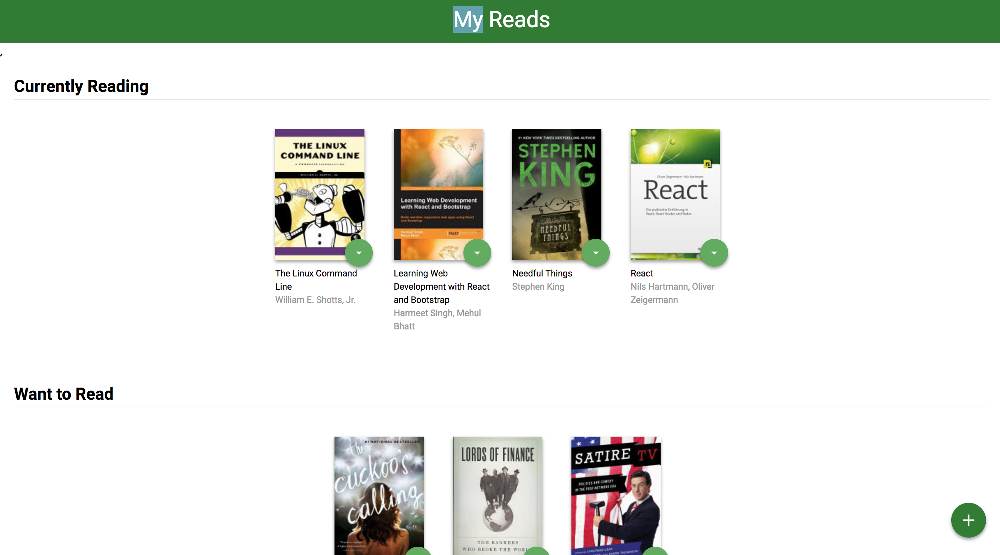
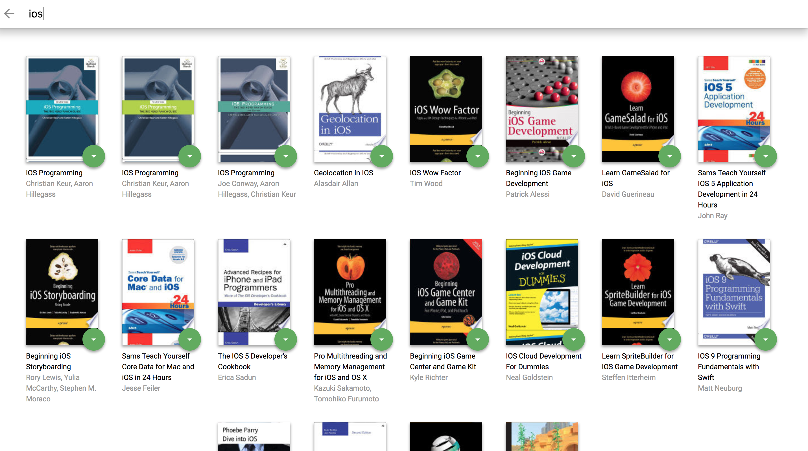
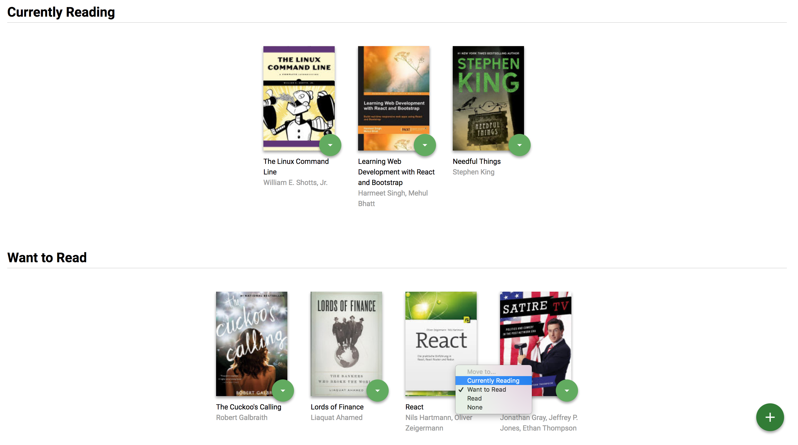

# MyReads Project

This is the first project during Udacity React Nanodegree. My reads is a React application that allows a user to categorize books in 3 different shelves.

* Currently reading
* Want to read
* Read

The books are being retrieved from an [`API`](https://reactnd-books-api.udacity.com).

I TDD'ed the project until the `SearchPage` then due to a lack of time I had to stop writting tests and just finish the project. By the way, testing isn't required or covered in this course.

## Screenshots

## How it works

When the app starts and the page loads, you are presented with 3 shelves and a couple of books that come by default in each shelf.

You then have the option to instantly move books from one shelf to another. 

To add new books click the + button down-right which will open a new search page. This is achieved using React Router and and it's all handled in the front-end. There are no back-end routes in this project.

Search books by their title. As you type in the input field new books will be rendered on the page, using data from the API. You will notice that the search results that are already on some shelf will display that particular shelf when you click on the shelf changer button. State persists accross the main page and the search page.

From the search results you can add whatever books you want to any existing shelf and see the results instantly on the main page.

## Main Components

* `<App/>`
    * top level component; holds the books state;
    * renders  `<Header/>`,`BookList`, `SearchPage` and `<OpenSearch/>`
    * sends request to `getAll` books in `ComponentDidMount`
    * sends request to update the books shelves on the server
    * has routes for the main page `/` and search page  `/search` 
* `<Book/>`
    * renders individual books
    * has `handleShelfChange` to send information up the chain when a shelf is being changed
* `<BookShelf/>`
    * renders books under correct shelf according to their shelf property
    * has `handleShelfChange` to send information up the chain when a shelf is being changed
* `<BooksList/>`
    * filters the books form the global state according to their shelves and distributes them to each shelf
    * renders the 3 shelves with correct corresponding books
     * has `passBookUpdateDetails` to send information up the chain when a shelf is being changed
* `<SearchPage/>` 
    * provides search functionality for books available from the API
    * renders books that match the search criteria
    * has `handleShelfChange` to send information up the chain when a shelf is being changed
    * maintains books state from search results to match the main page 

## Secondary components

* `<Header/>` - renders the title of the page
* `<OpenSearch/>` - renders the search button on the main page

To get started developing right away:

* download or clone the repository, using the `master` branch
* install all project dependencies with `npm install`
* start the development server with `npm start`

To see the tests run `npm test`

## Important
The backend API uses a fixed set of cached search results and is limited to a particular set of search terms, which can be found in [SEARCH_TERMS.md](SEARCH_TERMS.md). That list of terms are the _only_ terms that will work with the backend, so don't be surprised if your searches for Basket Weaving or Bubble Wrap don't come back with any results.

This project was bootstrapped with [Create React App](https://github.com/facebookincubator/create-react-app)

##TO DO

* fix the App tests to include React Router
* write all remaining relevant tests
* cover some edge cases

